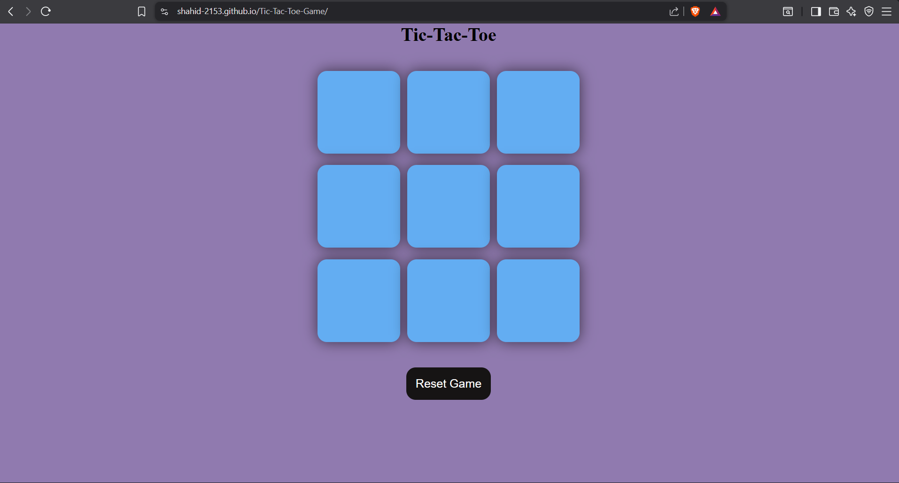

# Tic-Tac-Toe Game ❌⭕  

A clean and interactive **Tic-Tac-Toe** web game built using **HTML, CSS, and JavaScript**.  
Play with a simple UI, smooth gameplay, and instant winner/draw detection.

---

## 🚀 Features

- ✅ Classic 3x3 Tic-Tac-Toe gameplay  
- ✅ Two-player mode (Player X vs Player O)  
- ✅ Winner detection with highlight logic  
- ✅ Draw detection when no moves are left  
- ✅ Restart / New Game functionality  
- ✅ Responsive UI for better experience  

---

## 🛠️ Tech Stack

- **HTML** – Game layout and structure  
- **CSS** – Styling and responsive design  
- **JavaScript** – Game logic, winner checking, DOM updates  

---

## 📂 Project Structure

Tic-Tac-Toe-Game/
│
├── index.html
├── style.css
├── script.js
├── README.md
└── LICENSE


---

## 🎯 How to Play

1. Open the game in your browser.
2. Player **X** starts first.
3. Players take turns selecting an empty box.
4. The game ends when:
   - ✅ A player matches 3 in a row (Win)
   - ➖ All boxes are filled (Draw)

---

## 🧠 Game Rules

A player wins by marking **three cells in a row**:

- Horizontally ✅  
- Vertically ✅  
- Diagonally ✅  

---

## ▶️ Run Locally

1. Clone the repository:
   ```bash
   git clone https://github.com/your-username/Tic-Tac-Toe-Game.git
   
2. Go to the project folder:
   cd Tic-Tac-Toe-Game
   
3. Open index.html in your browser
   (Recommended: use Live Server in VS Code)

